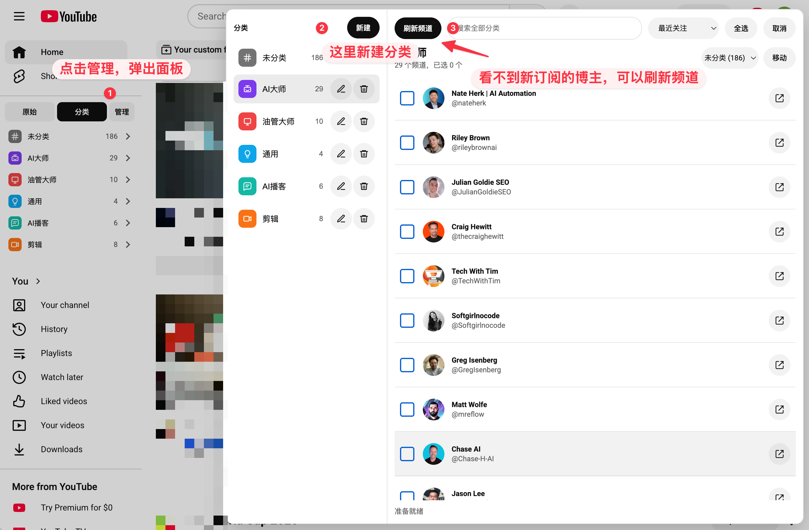

<p align="center">
  
</p>

<h1 align="center">YTD List Pro</h1>

<p align="center">
  A browser extension that organizes your YouTube subscriptions into visual categories, right inside the YouTube sidebar
</p>

<p align="center">
  <a href="README.md">中文</a> ·
  English
</p>

<p align="center">
  <a href="https://github.com/lxfater/ytd-list-pro/releases/latest"><b>⬇️ Download the prebuilt package</b></a> (no build needed — see <a href="#install">Install</a>)
</p>

---

## Features

- **Subscription sync** — reads the full subscription list of the currently signed-in YouTube account and stores it locally.
- **Unlimited categories** — create categories with custom names, colors, and icons.
- **Native sidebar** — categories blend into the YouTube sidebar and can replace the long stock subscription list; switch back anytime.
- **Quick add** — an "add to category" button appears next to the subscribe button on watch and channel pages; it also shows which category the channel currently belongs to.
- **Global search** — search across all categories with multiple keywords in any order; results are tagged with their category.
- **Bulk management** — multi-select, bulk move, drag-and-drop, and flexible sorting in the manager panel.
- **Multi-account isolation** — each YouTube account keeps its own categories; switching accounts never mixes data. Data from older versions is migrated automatically to the first account used after upgrading.
- **New-video indicator** — a background poll checks each subscribed channel's public RSS feed on a schedule; channels with an unseen new upload show a small red dot on their avatar in the sidebar, which clears once you open the channel. It only tracks uploads published after the feature started tracking that channel — it is not the same as YouTube's own "unwatched" status.
- **Import / Export** — export all categories to a CSV file (opens directly in Excel) and bulk-import from CSV.
- **Local-first** — all state lives in `chrome.storage.local`; there is no backend.

## How to Use



Follow steps ①②③ in the screenshot (the extension UI is in Chinese; English equivalents in parentheses):

1. **Open the manager panel** (① in the screenshot) — after installation, a switcher appears at the top of the YouTube sidebar with three buttons: 原始 (Original) / 分类 (Categories) / 管理 (Manage). Click 管理 (Manage) to open the category manager panel.
2. **Create categories and organize channels** (②) — click 新建 (New) to create your own categories, then tick channels and click 移动 (Move) — or simply drag them — to file them into categories. The search box at the top finds channels across all categories.
3. **Refresh channels** (③) — on first use, click 刷新频道 (Refresh channels) to pull in your subscriptions. **Whenever you subscribe to a new creator and don't see them in the list, click refresh and they will appear.**

Once organized, switch the left sidebar to 分类 (Categories) mode and click any category to browse its channels — no more scrolling through one long, messy subscription list. There is an even faster way in daily use: on any watch or channel page, an 加入分类 (Add to category) button appears next to the subscribe button — click it and pick a category, no manager panel needed.

There is an even faster way in daily use: on any watch page or channel page, an 加入分类 (Add to category) button appears next to the subscribe button. Click it and pick a category — done, without ever opening the manager panel.

## Install

### Option 1: Download from Releases (recommended, no build needed)

No Node.js, no commands — just grab the prebuilt package:

1. Go to the [Releases page](https://github.com/lxfater/ytd-list-pro/releases/latest) and download the latest `ytd-list-pro-vX.Y.Z.zip`, then unzip it.
2. Open `chrome://extensions/` (`edge://extensions/` on Edge) and enable Developer mode in the top-right corner.
3. Click "Load unpacked" and select the unzipped folder.
4. Open [youtube.com](https://www.youtube.com) and sync your subscriptions following the guide above.

### Option 2: Build from source

```bash
npm install
npm run build
```

Then follow steps 2-4 above, selecting this project's `dist` directory when loading the unpacked extension.

## Export / Import

The manager panel toolbar has 导出 (Export) and 导入 (Import) buttons.

**Export** downloads all categories and channels as a CSV file (UTF-8 with BOM, so Excel opens it correctly, including CJK text).

**Import** accepts a CSV with the same structure. The first row is an optional header; every following row is one channel with three columns:

| 分类 (Category) | 频道名称 (Channel Name) | 频道链接 (Channel URL) |
| --- | --- | --- |
| AI Masters | Matt Wolfe | https://www.youtube.com/@mreflow |
| Coding | Tech With Tim | https://www.youtube.com/@TechWithTim |
| 未分类 | | https://www.youtube.com/channel/UCxxxxxxxx |

Column rules:

- **Category** (required) — the category name. Missing categories are created automatically; the name 未分类 (Uncategorized) routes the channel to the uncategorized list.
- **Channel Name** (optional) — inferred from the URL when empty, and replaced with the real name on the next subscription refresh.
- **Channel URL** (required) — both `https://www.youtube.com/@handle` and `https://www.youtube.com/channel/UC...` forms are supported.
- Channels that already exist (matched by channel ID or handle) are **moved** to the target category rather than duplicated; unrecognized rows are skipped and reported with their line numbers in the status bar.

Tip: the safest way to build an import file is to export first and edit that CSV as a template.

## Development

```bash
npm install
npm test -- --run   # run tests
npm run typecheck   # type check
npm run build       # build to dist/
```

## Privacy

- This extension ships with **no** real user's subscription data.
- Subscription data is read in the active YouTube tab using your existing YouTube session and stored only in local browser storage.
- There is no backend service; subscription lists are never uploaded to any third-party server.
- The content script reads YouTube page configuration solely to call YouTube's own internal subscription endpoint from the YouTube origin; no cookie values are logged, committed, or sent outside YouTube.
- The new-video indicator calls YouTube's public RSS endpoint (`youtube.com/feeds/videos.xml`) — no login or cookies required — solely to compare upload timestamps. Results are stored locally only.

## License

[MIT](LICENSE)
